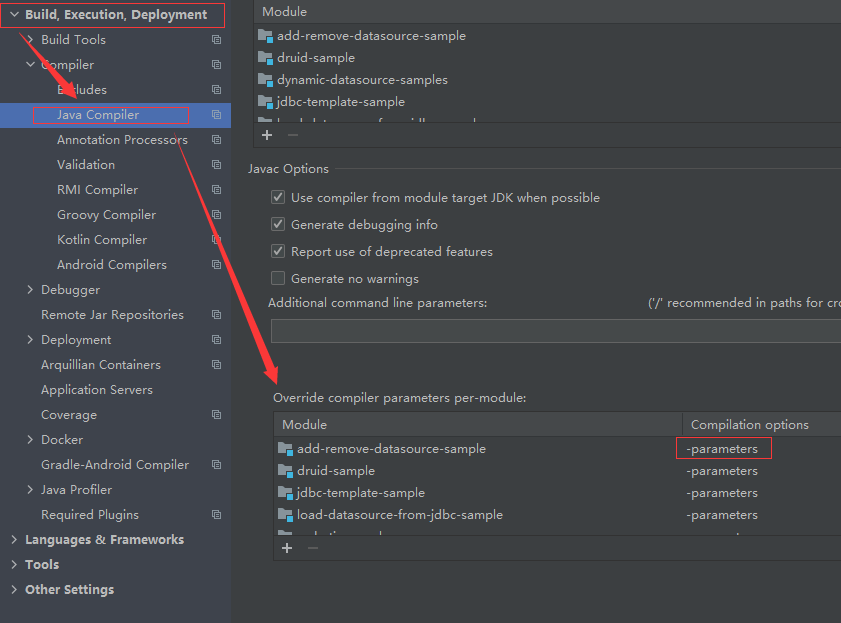

# 动态解析数据源

默认有三个职责链来处理动态参数解析器 header->session->spel
所有以  `#`   开头的参数都会从参数中获取数据源。

```java
@DS("#session.tenantName")//从session获取
public List selectSpelBySession() {
	return userMapper.selectUsers();
}

@DS("#header.tenantName")//从header获取
public List selectSpelByHeader() {
	return userMapper.selectUsers();
}

@DS("#tenantName")//使用spel从参数获取
public List selectSpelByKey(String tenantName) {
	return userMapper.selectUsers();
}

@DS("#user.tenantName")//使用spel从复杂参数获取
public List selecSpelByTenant(User user) {
	return userMapper.selectUsers();
}
```

::: tip 如何扩展?

1. 我想从cookie中获取参数解析?

2. 我想从其他环境属性中来计算?

参考header解析器,继承DsProcessor,如果matches返回true则匹配成功,调用doDetermineDatasource返回匹配到的数据源,否则跳到写一个解析器.
:::

1. 自定义一个处理器。
```java
public class DsHeaderProcessor extends DsProcessor {

    private static final String HEADER_PREFIX = "#header";

    @Override
    public boolean matches(String key) {
        return key.startsWith(HEADER_PREFIX);
    }

    @Override
    public String doDetermineDatasource(MethodInvocation invocation, String key) {
        HttpServletRequest request = ((ServletRequestAttributes) RequestContextHolder.getRequestAttributes()).getRequest();
        return request.getHeader(key.substring(8));
    }
}
```

2. 重写完后重新注入一个根据自己解析顺序的解析处理器.

```java
   @Bean
   @ConditionalOnMissingBean
   public DsProcessor dsProcessor() {
        DsHeaderProcessor headerProcessor = new DsHeaderProcessor();
        DsSessionProcessor sessionProcessor = new DsSessionProcessor();
        DsSpelExpressionProcessor spelExpressionProcessor = new DsSpelExpressionProcessor();
        headerProcessor.setNextProcessor(sessionProcessor);
        sessionProcessor.setNextProcessor(spelExpressionProcessor);
        return headerProcessor;
   }
```


## 动态解析使用方式
1. 在类下面的方法使用
```java
public class UserService{
    @DS("#user.tenantName")//使用spel从复杂参数获取
    public List selecSpelByTenant(User user){
    }
}
```

2. 在接口下面的方法使用
```java
public interface UserMapper{
    // 前缀可以是p0,a0
    @DS("#p0.tenantName")
    public List selecSpelByTenant(User user);
}
```

对于在接口下面的使用, 由于编译器的默认配置没有将接口参数的元数据写入字节码文件中.  
所以spring el会无法识别参数名称, 只能用默认的参数命名方式

1. 第一个参数: p0,a0,(加入-parameter后,可以使用参数具体的名字,例如这里的#user)
2. 第二个参数: p1,a1
3. 第三个参数: P2,a2

可以通过修改maven配置和java编译配置将接口参数信息写入字节码文件  
maven配置:
```xml
    <plugin>
        <groupId>org.apache.maven.plugins</groupId>
        <artifactId>maven-compiler-plugin</artifactId>
        <!-- 想启用  <parameters>true</parameters> 的maven编译最低版本为:3.6.2 -->
        <version>3.6.2</version>
        <configuration>
            <source>${java.version}</source>
            <target>${java.version}</target>
            <parameters>true</parameters>
        </configuration>
    </plugin>
```

idea java编译配置: ` -parameters`  
> java 支持-parameters的最低版本为 1.8




